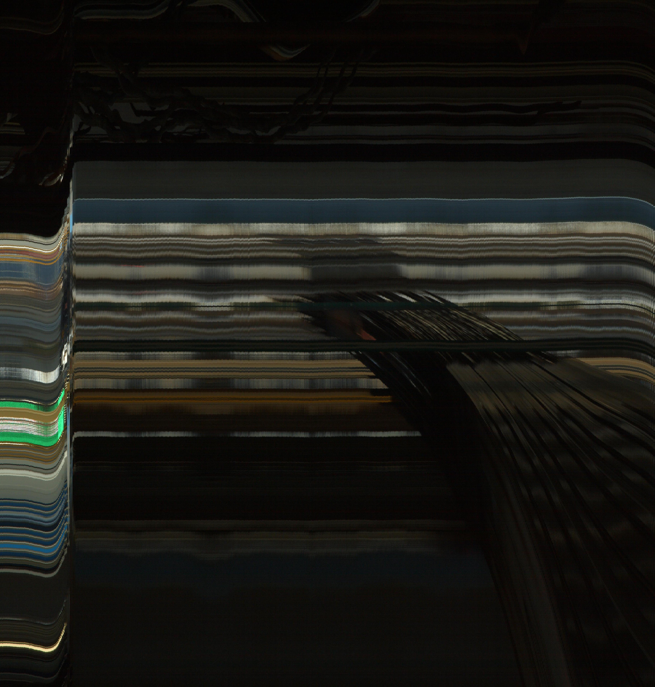
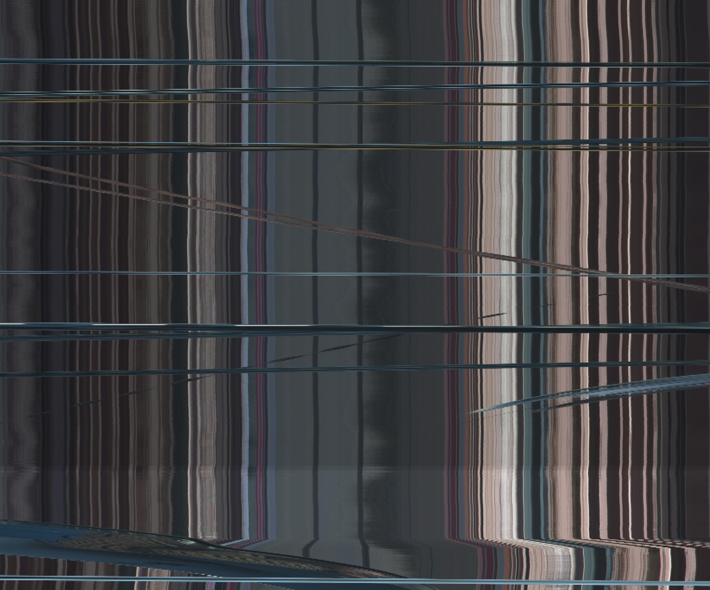

# slit_scanner_darkly
Slit scanning. From frames to weird final product.

This is a repository that allows for creating several types of slitscans (examples available further down the page).

**Dependencies:**
[PIL] (http://www.pythonware.com/products/pil/)
[Numpy] (http://www.numpy.org/)

**Single Slitscans:**
Single slitscans come in two flavors: horizontal and vertical. This style of slitscan is inspired by [Adam Magyar's Urban Flow project] (http://www.magyaradam.com/).

**Moving Slitscans:**
Like the single slitscans (horizontal and vertical), but compiled over ~all~ the images in a sequence. Each new frame
is a single slitscan from a different x or y coordinate. 

# Usage:
**Required Args:**

Flags | Help
------------ | -------------
-i, --input_dir | input directory (set of video frames)
-o, --output_dir | output directory (script will create subfolder)

**Optional:**

Flags | Help
------------ | -------------
-t, --slitscan_type | Type of slitscan to be performed. [0]=single-vertical, [1]=single-horizontal [2]=Moving-Horizontal, [3]=Moving-Vertical, [4]=Moving-Both (Vertical AND Horizontal)
-slit, --slit_size | Slit Size (default=5)
-l, --frame_limit | Limit number of frames to specified int (default = -1)
-format, --output_format | Output image format (default="JPEG")

# Examples:
Github doesn't let me embed YouTube vids... lame.
### Original Footage:
Train Station:

https://www.youtube.com/watch?v=t-guLsCS_pg

Bridge:

https://www.youtube.com/watch?v=-JRnao5nn_U

### Single Slitscan (height)
`cli.py -i <input_dir - set of video frames> -o <output_dir> -slit 5 -t 0`

Train Station:

Bridge:

### Single Slitscan (width)
`cli.py -i <input_dir - set of video frames> -o <output_dir> -slit 5 -t 1`

Train Station:

Bridge:

### Moving Slitscan (height)
`cli.py -i <input_dir - set of video frames> -o <output_dir> -slit 5 -t 2`
Train Station:

https://www.youtube.com/watch?v=Mm9q6qhgt7Y

Bridge:

https://www.youtube.com/watch?v=e5PUNPEcwTI

### Moving Slitscan (width)
`cli.py -i <input_dir - set of video frames> -o <output_dir> -slit 5 -t 3`

https://www.youtube.com/watch?v=UCeJmNJHFNI

https://www.youtube.com/watch?v=3k-TRcbbit8
